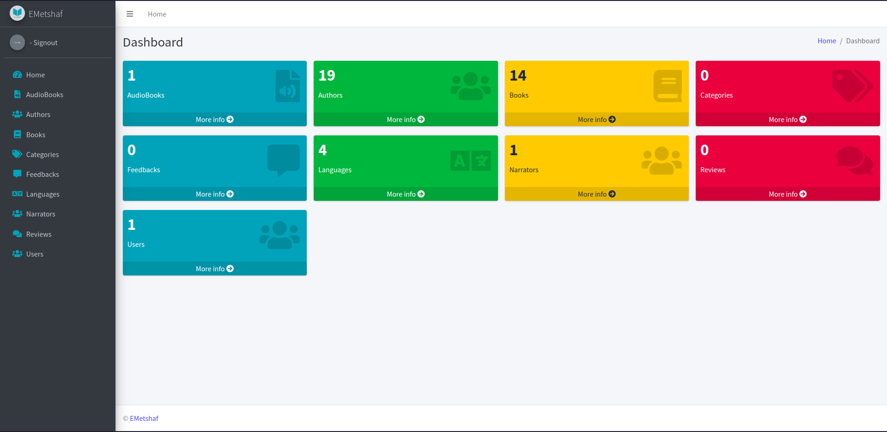
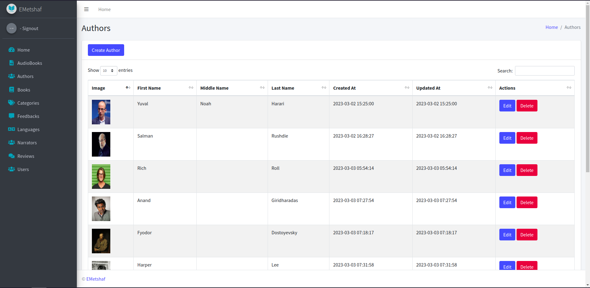
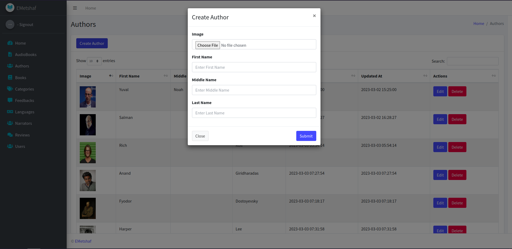
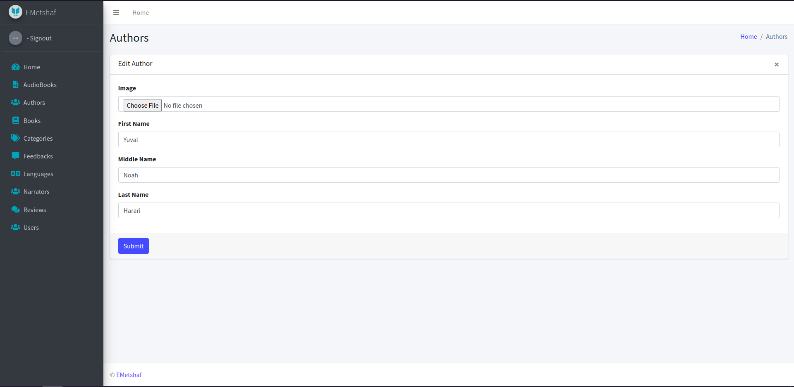
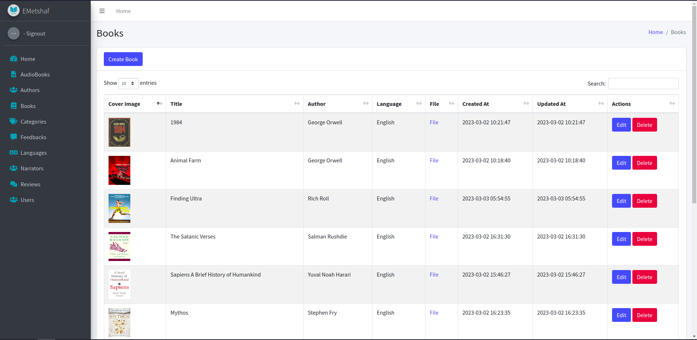
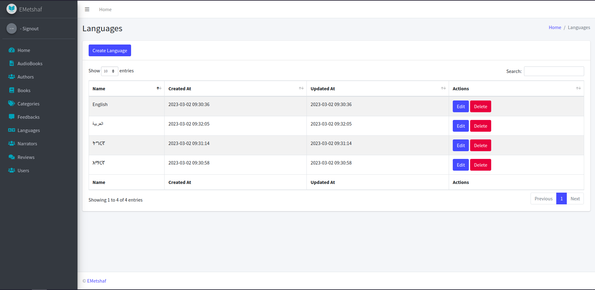
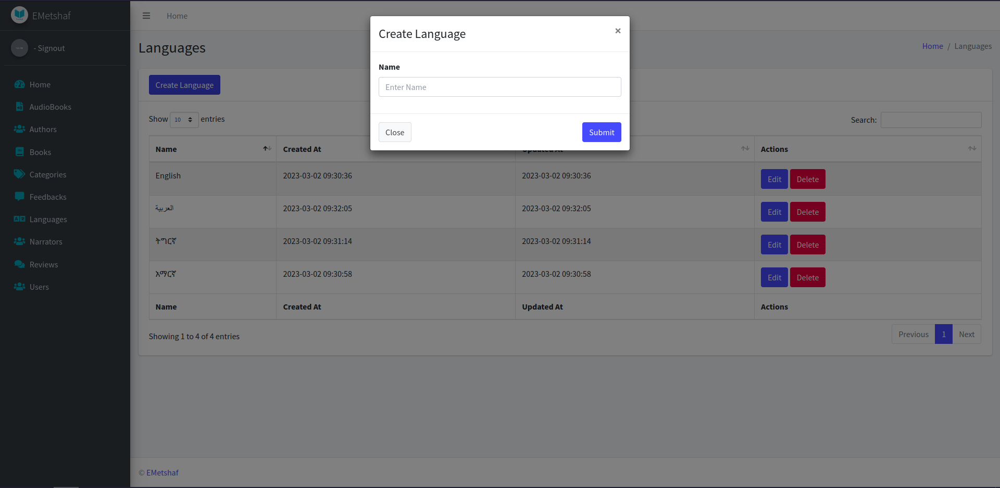
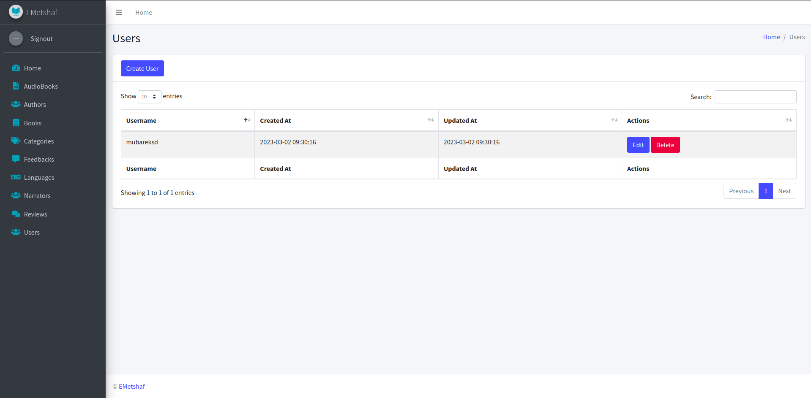

# 📗 Table of Contents

- [📖 EMetshaf ](#emetshaf)
  - [🛠 Built With](#built-with)
    - [Features](#features)
  - [🚀 Live Demo](#live-demo)
  - [💻 Getting Started](#getting-started)
    - [Prerequisites](#prerequisites)
    - [Setup](#setup)
    - [Usage](#usage)
  - [Screenshots](#screenshots)
  - [👥 Author](#author)
  - [🤝 Contributing](#contributing)
  - [❓ FAQ](#faq)
  - [📝 License ](#license)

# 📖 EMetshaf <a name="emetshaf"></a>

EMetshaf is an E-Book and Audio Book Store

## 🛠 Built With <a name="built-with"></a>

- Python

### Features <a name="features"></a>

- [ ] Authentication
- [x] AudioBook Management
- [x] Author Management
- [x] Book Management
- [x] Category Management
- [x] Feedback management
- [x] Language Management
- [x] Narrator Management
- [x] Review Management
- [x] User Management

## 🚀 Live Demo <a name="live-demo"></a>

[Live Demo Link](https://mubareksd.tech)

## 💻 Getting Started <a name="getting-started"></a>

### Prerequisites <a name="prerequisites"></a>

- Python 3.9+

  - ubuntu/Debian

    ```sh
    sudo apt install python3
    ```

  - Arch/Manjaro

    ```sh
    sudo pacman -S python3
    ```

  - Redhat/Fedora

    ```sh
    sudo yum install python3
    ```

### Setup <a name="setup"></a>

- clones the project

  ```sh
  git clone https://github.com/emetshaf/emetshaf
  ```

- cd into the project

  ```sh
  cd emetshaf
  ```

- create virtual environment

  ```sh
  python3 venv env
  ```

- activate the environment

  ```sh
  source env/bin/activate
  ```

- install the required python packages

  ```sh
  pip install -r requirements.txt
  ```

### Usage <a name="usage"></a>

- start the api application

  ```sh
  tmux new-session -d 'gunicorn --config gunicorn-cfg.py run:api'
  ```

- start the web application

  ```sh
  tmux new-session -d 'gunicorn --config web/gunicorn-cfg.py run:web'
  ```

## Screenshots <a name="screenshots"></a>

| Page No | Page Name             | Screenshot                                                        |
| ------- | --------------------- | ----------------------------------------------------------------- |
| 01      | Admin Dashboard       |              |
| 02      | Admin Authors         |                  |
| 03      | Admin Create Author   |      |
| 04      | Admin Edit Author     |          |
| 05      | Admin Books           |                      |
| 06      | Admin Languages       |              |
| 07      | Admin Create Language |  |
| 08      | Admin Users           |                      |

## 👥 Author <a name="author"></a>

👤 **Mubarek Seid Juhar**

- GitHub: [@githubhandle](https://github.com/mubareksd)
- Twitter: [@twitterhandle](https://twitter.com/mubareksd)
- LinkedIn: [LinkedIn](https://linkedin.com/in/mubareksd)

## 🤝 Contributing <a name="contributing"></a>

Contributions, issues, and feature requests are welcome!

- Issues Bugs Feature Requests

  check out [issues page](../../issues/).

- Contributing

  check out [CONTRIBUTING.md](./CONTRIBUTING.md).

- Code of Conduct

  check out [CODE_OF_CONDUCT.md](./CODE_OF_CONDUCT.md).

## ❓ FAQ <a name="faq"></a>

## 📝 License <a name="license"></a>

```text
    Copyright 2023 EMetshaf

    Licensed under the GNU General Public License, Version 3.0 (the "License");
    you may not use this file except in compliance with the License.
    You may obtain a copy of the License at

    https://www.gnu.org/licenses/gpl-3.0.en.html

    Unless required by applicable law or agreed to in writing, software
    distributed under the License is distributed on an "AS IS" BASIS,
    WITHOUT WARRANTIES OR CONDITIONS OF ANY KIND, either express or implied.
    See the License for the specific language governing permissions and
    limitations under the License.
```
